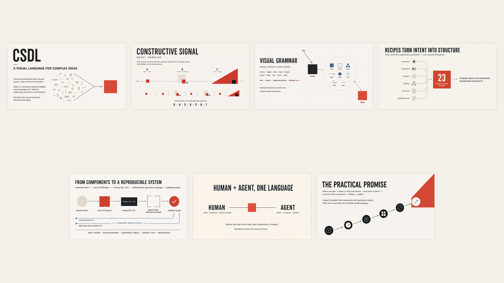
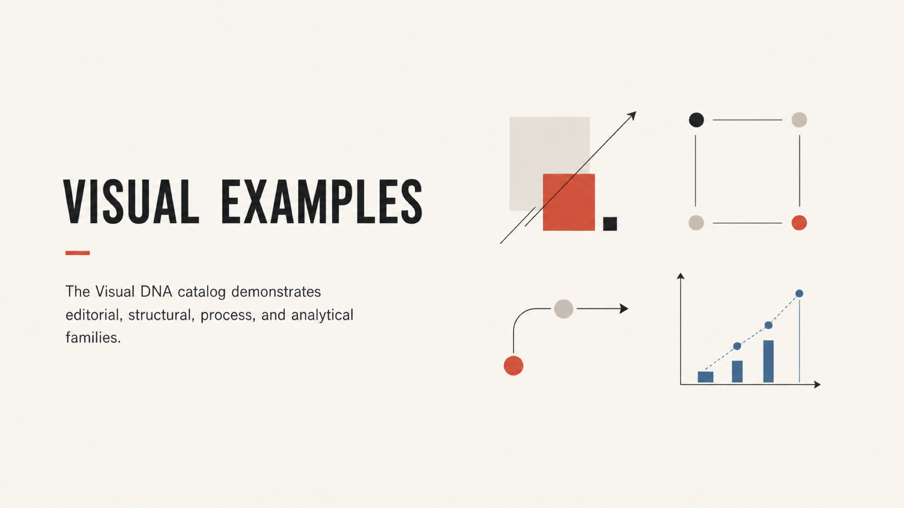

# Constructive Signal Design Language

**CSDL is a versioned visual language for explaining complex ideas with people and generative models.**

It turns presentation design into a shared, machine-readable system of components, recipes, constraints, and validation.

[](docs/demo-infographic/README.md)

> **Project status:** Foundation through Cookbook and Design Book v1.0 is complete. CSDL is source-available for noncommercial use under D-034; a tagged public release remains pending.

## Why CSDL exists

Technical presentations often become generic, noisy, and difficult to reproduce.

Templates solve consistency by fixing layouts. Style prompts provide freedom but encourage drift. CSDL takes a different approach: it defines the meaning of visual elements and the rules connecting them.

The result is a presentation system that stays recognizable without becoming repetitive.

## What CSDL gives you

- **Faster comprehension.** One screen carries one idea, one mechanism, and one dominant Signal.
- **Coherent series.** Quiet, constructive, and signal moments create controlled presentation rhythm.
- **Reusable structure.** Components and Recipes solve explanatory problems without prescribing fixed layouts.
- **Human-agent alignment.** Authors and generative models use the same vocabulary and source contracts.
- **Verifiable output.** Exact copy, quantitative fidelity, provenance, and accessibility remain testable.
- **Creative range with constraints.** Semantic geometry creates variety while preserving a recognizable identity.

## How it works

```text
explanatory intent
      ↓
one of 23 Recipes
      ↓
15 semantic components
      ↓
Prompt DSL v0.5 package
      ↓
reference-first generation
      ↓
review and deterministic validation
```

Start with the communication problem, not a preferred layout. Select a Recipe for that problem. Construct its mechanism with named components. Bind exact content and constraints in Prompt DSL. Generate against approved references, then validate the result.

For example, this simplified excerpt describes one dominant quantity without pixel coordinates:

```yaml
language: CSDL
version: "0.5"
kind: generation-package

recipe:
  id: "004"
  slug: big-number

semantic_intent:
  problem: Make one exact quantity the dominant explanatory object.
  scenario: count

content:
  bindings:
    value: "3"
    label: EXPRESSION LEVELS
    supporting_copy: QUIET · CONSTRUCTIVE · SIGNAL

component_instances:
  - id: pulse
    component: Pulse
    role: primary
  - id: signal
    component: Signal
    role: dominant

relations:
  - subject: signal
    type: highlights
    object: pulse

generation_constraints:
  expression: A
  canvas:
    ratio: "16:9"
    width: 1920
    height: 1080
  presentation:
    one_main_idea: true
    one_visual_mechanism: true
    one_dominant_signal: true
```

See the [complete validated package](recipes/recipe-library-v0.5/proofs/packages/01-editorial.yaml) for all constraints and provenance.

## The visual language

CSDL uses **Constructive Signal** as its direction and **Quiet Modular** as its default expression.

Its visual grammar follows six principles:

1. **Meaning before decoration.** Every element communicates structure, state, direction, relation, or emphasis.
2. **Space is content.** Default compositions preserve 50–75% negative space.
3. **Geometry explains.** Scale, distance, containment, overlap, and direction carry meaning.
4. **One idea, one signal.** Color emphasizes meaning instead of decorating the canvas.
5. **Intensity creates rhythm.** Level A is quiet, Level B constructive, and Level C emphatic.
6. **Markdown stays canonical.** Raster examples calibrate the written and machine-readable system.

A standard seven-slide series follows this rhythm:

```text
A → A → B → A → B → A → C
```

Level C remains rare. This prevents every slide from competing for attention.

## Visual examples

The Visual DNA catalog demonstrates editorial, structural, process, and analytical families:

[](patterns/visual-dna-sprint-01/README.md)

The current evidence includes:

- [English CSDL overview](docs/demo-infographic/README.md) — seven slides explaining the system itself.
- [Visual DNA Sprint 1](patterns/visual-dna-sprint-01/README.md) — twenty accepted pattern families.
- [Pilot 01: Agentic Discipline](pilots/01-agentic-discipline/README.md) — the first complete seven-slide series.
- [Pilot 02: Superpowers vs Compound Engineering](pilots/02-superpowers-vs-compound-engineering/README.md) — an eight-slide applied comparison.
- [Cookbook and Design Book v1.0](cookbook/design-book-v1.0/README.md) — a 32-page system guide.

## System layers

| Layer | What it provides | Current contract |
|---|---|---|
| Foundation | Direction, canvas, rhythm, typography, color, and quality rules | v0.1 |
| Visual DNA | Accepted examples across editorial, structural, process, and analytical needs | 20 families |
| Components | Closed semantic vocabulary for constructing compositions | 15 components |
| Recipes | Evidence-backed solutions for recurring explanatory problems | 23 Recipes |
| Prompt DSL | Declarative packages for content, structure, constraints, and provenance | v0.5 |
| Analytical Mode | Typed data, encodings, transformations, uncertainty, and fidelity rules | v0.1 |
| Accessibility | Light, night, monochrome, and projector semantic profiles | v0.1 |
| Design Book | Canonical publication covering the complete system | v1.0 |

## Analytical Mode v0.1

Analytical Mode v0.1 is complete as an additive typed-data and encoding contract. It preserves exact values, domains, order, units, sources, missing-data behavior, transformations, uncertainty, and forecasts without changing Prompt DSL v0.5 or the public component vocabulary.

## Night Mode and Accessibility v0.1

Night Mode and Accessibility v0.1 are complete as an independent additive extension. Light, night, monochrome, and projector profiles preserve semantic meaning through validated contrast, redundant encodings, and deterministic fallbacks without modifying accepted raster evidence.

## Create a CSDL presentation

Use the repository-local `csdl-create` skill with Codex:

```text
$csdl-create Create a CSDL series explaining [topic] for [audience].
```

The workflow converts your material into an approved brief, exact copy, Recipes, Prompt DSL packages, three candidates per slide, selected canonical assets, previews, a contact sheet, scores, and review evidence.

The user approves the narrative, slide count, copy, and expression rhythm before raster generation.

Read the [skill contract](ai/skills/csdl-create/SKILL.md) for the complete workflow.

## Explore the repository

Start with these paths:

- [`specs/2026-07-17-csdl-v0.1-design.md`](specs/2026-07-17-csdl-v0.1-design.md) — Foundation design specification.
- [`components/component-library-v0.1/`](components/component-library-v0.1/) — component contracts and compatibility.
- [`recipes/recipe-library-v0.5/`](recipes/recipe-library-v0.5/) — Recipes and Prompt DSL v0.5.
- [`analytics/analytical-mode-v0.1/`](analytics/analytical-mode-v0.1/) — quantitative semantics and proofs.
- [`accessibility/night-mode-v0.1/`](accessibility/night-mode-v0.1/) — accessible output profiles.
- [`cookbook/design-book-v1.0/`](cookbook/design-book-v1.0/) — canonical Design Book sources.
- [`STATUS.md`](STATUS.md) — verified project state and outputs.
- [`DECISIONS.md`](DECISIONS.md) — locked design and architecture decisions.

## Validate locally

CSDL keeps its specifications, examples, generated indexes, and evidence under automated checks.

```bash
python -m venv .venv
source .venv/bin/activate
python -m pip install -e '.[dev]'
python -m pytest -q
```

Run the strict validator for any system layer you change. The full command list lives in [`AGENTS.md`](AGENTS.md).

## Contributing

Read [`CONTRIBUTING.md`](CONTRIBUTING.md), [`AGENTS.md`](AGENTS.md), [`DECISIONS.md`](DECISIONS.md), and [`STATUS.md`](STATUS.md) before proposing changes. Preserve canonical copy, accepted raster evidence, public vocabulary, and version boundaries.

To preserve single-owner copyright, external copyrightable contributions are not accepted without a prior written copyright assignment. Do not begin tagged release work, change locked decisions, or replace accepted rasters without explicit approval.

## License

CSDL is **source-available for noncommercial use**. It is not OSI open source.

- Software, schemas, machine-readable packages, tools, and agent implementations use the [PolyForm Noncommercial License 1.0.0](LICENSES/PolyForm-Noncommercial-1.0.0.md).
- Original documentation and visual materials use [CC BY-NC-SA 4.0](LICENSES/CC-BY-NC-SA-4.0.txt).
- Commercial use requires a separate written license from Vladyslav Ohirenko.
- CSDL names and branding are governed by the [trademark policy](TRADEMARKS.md).

The authoritative scope, attribution, exclusions, and commercial-use boundary are defined in [`LICENSE`](LICENSE).
