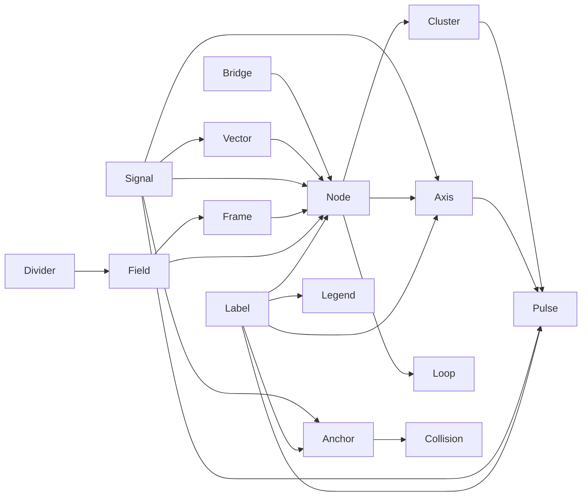

# Milestone 3 Component Evidence Audit

**Date:** 2026-07-18

**Scope:** Foundation v0.1, Pilot 01, and the accepted Milestone 2 Visual DNA Sprint 1 contracts and evidence

**Purpose:** distinguish observed component behavior from proposed Milestone 3 formalization before changing the public vocabulary

## Audit method

The audit read the Foundation specification, Pilot 01 manifest and Prompt DSL, all twenty Milestone 2 family manifest records, all twenty family specifications, all twenty family Prompt DSL packages, the complete family review record, the three D-028 primary-authority boards, and the completed all-family contact sheet.

Case-sensitive component-name mentions were counted across the Foundation, Pilot, and Milestone 2 Markdown/YAML evidence. Lowercase descriptive uses were then reviewed separately for `Label` and `Legend`, because neither is declared as a first-class family component in Milestone 2.

The baseline was independently revalidated before this audit:

```text
.venv/bin/python -m pytest -q                                      49 passed
Pilot manifest/style-anchor/assets/scores validators              pass
Milestone 2 catalog/data/assets/scores/review/index validators     pass
git diff --check                                                   pass
```

Local `main`, `origin/main`, and `HEAD` all resolved to `3a88ffdc3d56e935d4fed1a635365e2b311f4d7f` after `git fetch origin --prune`.

## Authority and ownership

The following hierarchy governs every contract derived below:

1. `DECISIONS.md`, especially D-015 through D-018 and D-028;
2. `specs/2026-07-17-csdl-v0.1-design.md` for Foundation semantics, canvas, expression, typography, color, and component vocabulary;
3. `patterns/visual-dna-sprint-01/visual-authority.yaml` and the three boards under `references/canonical/` as primary visual authority;
4. accepted Milestone 2 family specs, Prompt DSL, rasters, and review evidence;
5. the Pilot landscape anchor as secondary execution evidence.

Markdown remains the canonical semantic specification. YAML may encode and validate the same contract but may not invent a conflicting visual direction.

## Coverage summary

| Component | Exact-name mentions | Milestone 2 manifest families | Evidence strength | Principal owning evidence |
|---|---:|---:|---|---|
| Anchor | 67 | 8 | strong | Foundation nouns; Hero, Cover, Quote, Big Number, Comparison, Collision, Hierarchy, Framework |
| Signal | 153 | 18 | strong | Foundation one-signal rule; all families except Hierarchy and Architecture declare it directly |
| Field | 43 | 5 | strong | Foundation context meaning; Cover, Comparison, Before / After, Matrix, Architecture |
| Frame | 7 | 1 | bounded | Foundation analytical boundary; Table open lookup frame |
| Cluster | 28 | 2 | strong but narrow | Framework equal-concept group; Dashboard supporting-metric group |
| Vector | 38 | 3 | strong | Before / After transformation, Workflow route, Pipeline carrier |
| Divider | 21 | 2 | strong but narrow | Comparison distinction; Before / After state separation |
| Node | 86 | 10 | strong | Timeline, Matrix, Hierarchy, Architecture, Workflow, Loop, Pipeline, Decision Tree, Framework, Chart |
| Loop | 48 | 1 | strong | Pilot-backed Loop family and Foundation recipe 013 |
| Collision | 19 | 1 | strong | Collision family and Pilot share-card evidence |
| Bridge | 13 | 3 | strong but narrow | Hierarchy ownership, Architecture topology, Decision Tree branching |
| Axis | 33 | 6 | strong | Timeline, Matrix, KPI, Table, Chart, Dashboard |
| Pulse | 30 | 3 | strong | Big Number, KPI, Dashboard |
| Label | 3 exact; many lowercase uses | 0 declared | strong behavior, missing public contract | Foundation type token; direct labels in Big Number, Timeline, Matrix, KPI, Table, Chart, Dashboard and review evidence |
| Legend | 0 exact; one explicit lowercase exclusion | 0 declared | negative/conditional | Foundation Analytical Mode prefers direct labels; Chart review confirms no legend for a directly labeled single series |

The count is an audit aid, not a quality score. Components with one family can still have strong evidence when the accepted raster, Prompt DSL, and review record agree.

## Component findings

### Anchor

Confirmed:

- carries the main thesis or central concept;
- may be typographic, numeric-label, or semantic-object dominant;
- remains singular by default, except symmetric comparison or collision content where two peer Anchors are evidenced;
- precedes or owns subordinate Labels and supporting components;
- must remain the first semantic read even when a Signal is visually strong.

Evidence: Foundation sections 10–12; `specs/01-hero.md`, `02-cover.md`, `03-quote.md`, `04-big-number.md`, `05-comparison.md`, `06-collision.md`, `10-hierarchy.md`, and `16-framework.md`; the corresponding prompts and accepted review records.

Gap resolved in Milestone 3: distinguish semantic dominance from raw size. A large decorative form is not an Anchor without content ownership.

### Signal

Confirmed:

- marks the one state, result, transition, value, path, or boundary that needs immediate attention;
- is a semantic modifier attached to another component, never free decoration;
- follows the locked one-dominant-signal rule;
- uses the semantic palette and family-specific area ceiling;
- may be expressed by fill, weight, line, or component state rather than a separate object.

Evidence: D-010 and D-013; Foundation sections 4, 5, 9, and 10; all Milestone 2 signal contracts and accepted review records.

Owning clarification: `Signal` is a component role, not a synonym for coral geometry. A coral label plus a coral node can constitute two competing Signals even when the color matches, as rejected Timeline and Framework candidates demonstrate.

### Field

Confirmed:

- represents context, environment, or state scope;
- can remain visually open and be inferred from spacing, boundary fragments, or a restrained plane;
- can contain Nodes, Anchors, Frames, or Clusters;
- cannot become a decorative card background or generic panel.

Evidence: Foundation noun definition; Cover open scope, Comparison peer Fields, Before / After state Fields, Matrix coordinate Field, and Architecture system Field.

### Frame

Confirmed:

- creates a functional analytical or ownership boundary;
- may be open and use sparse rules rather than a closed rectangle;
- supports exact lookup in Table without becoming cell/card chrome.

Evidence: Foundation noun definition and Container exclusion; `specs/18-table.md`, `prompts/18-table.yaml`, and the accepted Table review.

Bounded extension: nested ownership brackets in the accepted Hierarchy raster are treated as open Frames in Milestone 3. This preserves observed scope semantics while retiring the undeclared `Container` alias.

### Cluster

Confirmed:

- groups related concepts, evidence, or measures without automatically implying order;
- preserves equality when equality is the teaching object;
- relies on alignment, repetition, and proximity rather than card shells;
- can contain Nodes, Labels, and a subordinate Pulse.

Evidence: Foundation noun definition; accepted Framework and Dashboard contracts and reviews; Pilot model/takeaway Cluster usage.

### Vector

Confirmed:

- communicates direction, action, or transformation;
- must have a semantic source and target;
- can be a single state-change vector, separate action vectors, or one continuous transformation carrier;
- cannot duplicate an Axis, Bridge, or Loop relation without adding meaning.

Evidence: Foundation structural definition and reading-path rules; Before / After, Workflow, and Pipeline accepted evidence.

### Divider

Confirmed:

- separates peer states, positions, or scopes without assigning moral priority;
- remains thin and subordinate;
- cannot become a decorative split-screen plane or an Axis when no scale/order exists.

Evidence: Foundation Comparison recipe; accepted Comparison and Before / After evidence.

### Node

Confirmed:

- represents one stage, actor, option, concept, gate, or data point;
- requires an identifiable semantic role and direct Label unless the content itself is rendered inside it;
- may be open, bare, solid, or bounded according to meaning;
- repeated Nodes must preserve comparable semantics and may not become dashboard cards or UI pills.

Evidence: Foundation noun definition and Loop recipe; ten Milestone 2 family contracts; repeated rejection of card shells, pills, icons, duplicate markers, and decorative network nodes.

### Loop

Confirmed:

- represents a closed recurring process whose output changes or feeds the next cycle;
- contains three to five ordered Nodes in current evidence;
- closes exactly once and keeps one unambiguous direction;
- allows one active Signal Node;
- must not be confused with an open workflow, feedback-like decoration, or orbit line.

Evidence: Foundation recipe 013; Pilot Card 05 prompt/review/raster; Milestone 2 Loop family audit.

### Collision

Confirmed:

- represents two forces or Anchors producing one named intersection, constraint, or synthesis;
- requires a consequential overlap; adjacency alone is insufficient;
- the overlap may be the Signal but cannot become debris, sparks, shards, or an unlabeled Venn diagram.

Evidence: Foundation structural definition; accepted Collision family review; Pilot share-card `Anchor + Signal + Collision` composition.

### Bridge

Confirmed:

- connects semantically distant Nodes, Fields, Frames, or Clusters;
- communicates topology, ownership, or explicit branching rather than continuous progress;
- may be directed, bidirectional, or labeled according to evidence;
- cannot masquerade as a workflow Vector or cross unrelated relations.

Evidence: Hierarchy, Architecture, and Decision Tree specs, prompts, and accepted reviews.

### Axis

Confirmed:

- establishes ordered progression, continuous comparison, lookup alignment, or quantitative domain;
- can carry Nodes and Labels;
- requires explicit semantic direction or domain;
- must not introduce pseudo-precise ticks or distort quantitative values.

Evidence: Foundation structural definition and Analytical Mode; Timeline, Matrix, KPI, Table, Chart, and Dashboard accepted evidence.

Owning clarification: KPI uses a subordinate alignment Axis without pretending it is a quantitative plot; Table uses row/column Axes inside a Frame; Chart requires a declared numeric domain.

### Pulse

Confirmed:

- represents one key number or measure;
- keeps value, unit, period, and Label attached;
- remains the first analytical read when primary;
- cannot introduce unsupported statistics, gauges, deltas, targets, or decorative digits.

Evidence: Big Number, KPI, and Dashboard specs/prompts/reviews, including measured signal-area audits.

### Label

Confirmed behavior:

- directly names a Node, Axis, Pulse, Field, Frame, Bridge branch, or other component;
- uses the Foundation `label` type token (`24–30 px`, line-height `1.10–1.25`) unless an analytical minimum requires a larger readable size;
- stays horizontal by default; only a short Label may rotate, and body copy never rotates;
- remains neutral unless color itself is the declared Signal;
- stays spatially attached to its target and cannot float ambiguously.

Evidence: Foundation typography rules; Big Number attached value label; Timeline stage labels; Matrix axis/node labels; Decision Tree branch labels; KPI/Table/Chart/Dashboard direct labels and sources; accepted review records that reject colored duplicate labels, missing labels, and invented label punctuation.

Contract gap: `Label` is visually and semantically mature but absent from all Milestone 2 `components` arrays. Milestone 3 makes it first-class without changing the rasters.

### Legend

Confirmed:

- direct Labels are preferred over a Legend in Analytical Mode;
- the accepted single-series Chart explicitly has no Legend;
- a Legend must not become a second visual mechanism or a decorative palette strip;
- color cannot be its only carrier; every key requires a text Label and/or distinct form.

Evidence: Foundation section 7 Analytical Mode; `specs/19-chart.md`, `prompts/19-chart.yaml`, and the accepted Chart review; the labeled swatch/key behavior on the D-028 primary boards as documentation-level calibration evidence.

Smallest repository-supported contract: Legend is an exceptional, bounded mapping component. It is compatible only with analytical `chart` and `dashboard` families when two to four categories cannot be directly labeled without collision. It is forbidden for the current single-series Chart proof and all editorial/structural families. This is a constrained contract, not evidence that a Legend should be added to any accepted raster.

## Component-to-family evidence map

The following map records direct Milestone 2 manifest usage. `Label` adds observed direct-label evidence; `Legend` records conditional compatibility only and is not present in a current canonical family instance.

| Component | Directly evidenced families |
|---|---|
| Anchor | hero, cover, quote, big-number, comparison, collision, hierarchy, framework |
| Signal | hero, cover, quote, big-number, comparison, collision, before-after, timeline, matrix, workflow, loop, pipeline, decision-tree, framework, kpi, table, chart, dashboard |
| Field | cover, comparison, before-after, matrix, architecture |
| Frame | table; hierarchy after Container alias resolution |
| Cluster | framework, dashboard |
| Vector | before-after, workflow, pipeline |
| Divider | comparison, before-after |
| Node | timeline, matrix, hierarchy, architecture, workflow, loop, pipeline, decision-tree, framework, chart |
| Loop | loop |
| Collision | collision |
| Bridge | hierarchy, architecture, decision-tree |
| Axis | timeline, matrix, kpi, table, chart, dashboard |
| Pulse | big-number, kpi, dashboard |
| Label | big-number, collision, timeline, matrix, hierarchy, architecture, workflow, loop, pipeline, decision-tree, framework, kpi, table, chart, dashboard |
| Legend | chart and dashboard conditionally; no active canonical use |

Across the fifteen-component library, every one of the twenty families has at least one compatible component and every family composition can be restated without `Container`.

## Dependency graph



This graph expresses validation dependencies, not mandatory visual inclusion. For example, an Anchor may carry its own text and need no separate Label instance; a Node-based composition need not contain an Axis.

## Repeated relations and owning contracts

| Relation | Owning contract | Evidence |
|---|---|---|
| `inside` / `contains` | Field or Frame owns scope; Cluster owns grouping | Cover, Architecture, Table, Framework |
| `attached_to` | Label owns direct naming; Signal owns emphasis attachment | Big Number, Timeline, KPI, Chart |
| `connected_to` | Bridge owns topology; Vector owns action/transformation | Architecture vs Workflow/Pipeline |
| `orders` | Axis owns open order; Loop owns closed order | Timeline vs Loop |
| `separates` | Divider owns peer distinction | Comparison, Before / After |
| `overlaps` / `produces` | Collision owns consequential intersection | Collision |
| `groups` | Cluster owns non-sequential related sets | Framework, Dashboard |
| `maps_to` | Legend owns indirect key mapping only | constrained analytical exception |
| `highlights` | Signal owns one dominant semantic emphasis | all accepted family review evidence |

The validator must reject a relation when the subject/target components do not permit it and must reject the same ordered component pair when one record allows and another forbids the identical relation under the same condition.

## Gaps and contradictions

### Container is outside the required Milestone 3 vocabulary

`Container` appears in the Foundation structural table and in Hierarchy, Architecture, and Pipeline manifests/prompts/specs, but it is not one of the fifteen required Milestone 3 components. Accepted rasters show that no separate public primitive is needed:

- Hierarchy uses nested open ownership boundaries, which `Frame` can own;
- Architecture uses one system `Field` plus `Node`s and `Bridge`s;
- Pipeline uses `Node`s and one continuous `Vector`; optional Container language adds no observed semantic role.

Resolution: update the three family specifications and their manifest/Prompt DSL arrays in one component packet, retire the Foundation `Container` alias in favor of the fifteen approved names, record the vocabulary decision in `DECISIONS.md`, preserve raster bytes and review evidence, and add a regression validator that forbids undeclared component names in active family contracts.

### Label is missing from machine-readable component arrays

Direct labeling is repeatedly required and reviewed, but `Label` is not declared in Milestone 2 arrays. Resolution: formalize it in Milestone 3 and allow family compatibility to record observed label use without rewriting every Milestone 2 family array solely to add a ubiquitous annotation role.

### Legend has only negative and calibration evidence

No accepted Milestone 2 family uses a Legend. Resolution: publish a constrained analytical exception with no current proof instance, clear direct-label precedence, and evidence status `constrained`. Do not alter any raster or expand full Analytical Mode.

### Signal is both a named component and a modifier

Family prompts sometimes describe a separate square/plane and sometimes a selected state on another component. Resolution: model `Signal` as a component role with a required target relation. The target may be rendered intrinsically; validators must not require a detached shape.

### Axis semantics vary by family

Timeline order, Matrix dimensions, Table lookup alignment, KPI support alignment, and Chart quantitative domain are not interchangeable. Resolution: one Axis component with enumerated semantic modes (`sequence`, `coordinate`, `lookup`, `support`, `quantitative`) and mode-specific invariants; no new chart grammar is added.

## Audit conclusion

The evidence supports fourteen components directly and supports a deliberately constrained Legend contract. The only active vocabulary contradiction is `Container`, and the accepted visuals already demonstrate a lossless mapping to `Frame`, `Field`, or no wrapper. No raster generation, locked-direction change, new dependency, or Milestone 4 recipe work is required.
